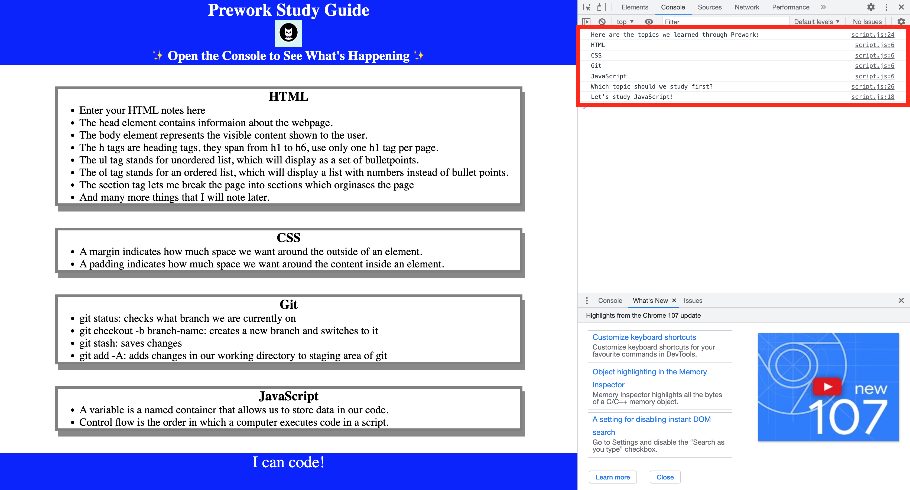

# Prework Study Guide Webpage

## Description

I had an idea for a simple note taking app that would also help me with deciding on the next topic to study whilst I go throught my web dev bootcamp, this is why I have built the Prework Study Guide.
Prework Study Guide gives you a place to store your notes seperated into sections based on topic. It also picks a topic at random for you to study, which is very helpful as you fill your study guide with more and more information.
Building the Prework Study Guide I have learned about building a simple webpage using HTML and CSS, also how to add logic using JavaScript.

## Installation

N/A

## Usage

To use this Study Guide, review the notes in each section. For suggestion on what to study first, open the Chrome DevTools by pressing <kbd>Command</kbd>+<kbd>Option</kbd>+<kbd>I</kbd> (MacOS) or <kbd>Control</kbd>+<kbd>Shift</kbd>+<kbd>I</kbd> (Windows). A console panel should open either below or to the side of the webpage in the browser. There you will see list of topics we learned from Prework along with a suggestion on which topic to study first.

## Credits

N/A

## License

Please refer to the LICENSE in the repo.

## Badges

